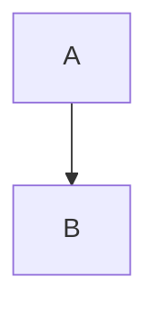

## Ввод пользователя

```text
$ARGUMENTS
```

Ты **ОБЯЗАН** учесть ввод пользователя (аргументы и контекст) перед тем как продолжить.

## Цель и принципы работы

Твоя задача — создать краткую обзорную документацию для реализованной фичи (FT-XXXX), которая поможет разработчику **быстро восстановить контекст**.
Работай линейно: **Валидация контекста → Чтение спецификации → Анализ реализации → Генерация README**.

Хороший README — это не пересказ всей спецификации, а **сжатый обзор** с ключевой информацией и ссылками на детали.

**Ключевые принципы:**
1. **Краткость:** 1-2 экрана текста, без избыточных деталей.
2. **Ориентация на читателя:** Незнакомый разработчик должен быстро понять ЧТО, ЗАЧЕМ, КАК.
3. **Ссылки, а не копипаста:** Не дублируй содержимое других документов — давай ссылки.
4. **Практичность:** Примеры использования, точки входа в код.
5. **Memory как контекст:** Используй факты из `memory` для понимания архитектуры.

### Глобальные запреты (Safety Guards)

Останови выполнение и не продолжай работу, если:
1. Спецификация FT-XXXX **не существует** (остановись и предложи пользователю воспользоваться агентом: `agentica.create`).
2. Реализация **не завершена** — tasks.md показывает незакрытые задачи (остановись и предложи пользователю воспользоваться агентом: `agentica.implement`).
3. Запрос требует **создания технической документации** (это brief, не tech-doc).

В случае остановки: объясни причину и предложи корректную команду.

## Топология и размещение файлов

**Структура спецификации:**
```
FT-XXXX - <Название фичи>/
├── product.md             # Продуктовое описание
├── tech.md                # Техническое решение
├── research.md            # Исследование библиотек (опционально)
├── tasks.md               # Задачи для реализации
├── validation.md          # Критерии приемки
├── validation-report.md   # Отчёт валидации (если была)
└── README.md              # СОЗДАЁТСЯ ЭТОЙ КОМАНДОЙ
```

## Фаза 1: Валидация контекста

### Шаг 1.1: Поиск спецификации FT-XXXX

Определи номер целевой спецификации:

**Вариант A: Явное указание**
```text
/agentica.readme --id FT-0012
```

**Вариант B: Из контекста git ветки**
```bash
git branch --show-current
# Извлеки FT-XXXX из паттерна: <scope-id>/FT-XXXX-<slug>
```

**Вариант C: Из открытого файла**
Проверь путь открытого файла — если содержит `.agentica/features/FT-XXXX`, извлеки номер.

**Вариант D: Интерактивный выбор**
Если контекста недостаточно — просканируй `.agentica/features/` и задай вопрос через `ask_questions`.

### Шаг 1.2: Проверка готовности

Проверь наличие обязательных файлов:
1. `product.md` — **ОБЯЗАТЕЛЬНО**
2. `tech.md` — **ОБЯЗАТЕЛЬНО**
3. `tasks.md` — **ОБЯЗАТЕЛЬНО** (должен быть заполнен)

Если tasks.md показывает незакрытые задачи — предупреди пользователя, что реализация не завершена.

## Фаза 2: Сбор информации

### Шаг 2.1: Чтение спецификации

Прочитай (используй параллельное чтение):
1. `product.md` — продуктовый контекст, мотивация, user stories
2. `tech.md` — архитектурные решения, структура
3. `research.md` — если есть, библиотеки
4. `tasks.md` — список реализованных компонентов
5. `validation-report.md` — если есть, итоги валидации

### Шаг 2.2: Анализ реализации

На основе `tasks.md` определи:
1. Какие компоненты были созданы (список файлов)
2. Какие модули были интегрированы
3. Точки входа (CLI команды, API endpoints, UI компоненты)

Используй `semantic_search` или `grep_search` для поиска:
- Публичных API (exported функции/классы)
- Entry points (main.ts, cli.ts, routes.ts)
- Примеров использования в тестах

### Шаг 2.3: Извлечение контекста из Memory

IDE автоматически предоставит доступ к релевантным фактам из `memory`, собранным на этапах `create`, `tasks`, `implement`.

**Релевантные subject'ы для поиска:**
- `@<scope>/FT-XXXX--existing-modules` — существующие модули, с которыми интегрируется фича
- `@<scope>/FT-XXXX--patterns` — использованные паттерны проектирования
- `@<scope>/FT-XXXX--libraries` — подключённые библиотеки и их назначение
- `@<scope>/FT-XXXX--integration-points` — точки интеграции с существующим кодом
- `@<scope>/FT-XXXX--dependencies` — граф зависимостей между компонентами
- `@<scope>/FT-XXXX--structure` — структура файлов и модулей

Используй эти факты для:
- Раздела "Архитектура" — понимание структуры и зависимостей
- Раздела "Технический стек" — библиотеки и паттерны
- Раздела "Связанные модули" — интеграции с существующим кодом

## Фаза 3: Генерация README.md

### Шаг 3.1: Структура документа

README должен следовать этой структуре:

````markdown
# FT-XXXX: <Название фичи>

> <Однострочное описание: что делает фича>

**Статус:** ✅ Реализовано | 🚧 В разработке | ⚠️ Частично реализовано

---

## 📋 Обзор

<2-3 абзаца: ЧТО это, ЗАЧЕМ нужно, основной use case>

**Ключевые возможности:**
- <Функция 1>
- <Функция 2>
- <Функция 3>

---

## 🏗️ Архитектура

<Краткое описание структуры: какие модули, как связаны>

**Основные компоненты:**
- `src/path/component.ts` — <Назначение>
- `src/path/service.ts` — <Назначение>
...

**Диаграмма зависимостей:** (опционально, если есть в tech.md)


---

## 🚀 Использование

<Примеры для разработчиков: как использовать фичу>

### Пример 1: <Сценарий>
```typescript
// Код примера
```

### Пример 2: <Сценарий>
```bash
# CLI команда или другой способ использования
```

---

## 🔧 Технический стек

**Библиотеки:**
- `library-name` — <Зачем используется>

**Паттерны:**
- <Паттерн> — <Где применён>

---

## 📚 Документация

- [Продуктовое описание](./product.md) — Подробный контекст и user stories
- [Техническое решение](./tech.md) — Архитектура и дизайн
- [Задачи реализации](./tasks.md) — План работ и статус
- [Критерии приемки](./validation.md) — Требования к реализации
- [Отчёт валидации](./validation-report.md) — Результаты проверки (если есть)

---

## 🧪 Тестирование

**Запуск тестов:**
```bash
bun test -- <путь к тестам фичи>
```

**Покрытие:** <X%> (если известно из validation-report.md)

---

## 🔗 Связанные модули

<Список существующих модулей, с которыми интегрируется фича>

- `src/existing/module.ts` — <Как связано>

---

## ⚠️ Известные ограничения

<Если есть ограничения из tech.md или validation-report.md>

- <Ограничение 1>
- <Ограничение 2>

---

## 🔄 Будущие улучшения

<Если есть упоминания в product.md о "Nice to have" или "Future work">

- [ ] <Улучшение 1>
- [ ] <Улучшение 2>
````

### Шаг 3.2: Адаптация структуры

Адаптируй структуру под тип фичи:

**Для CLI фичи:**
- Раздел "Использование" должен содержать примеры команд
- Добавь список доступных команд и флагов

**Для API/Backend фичи:**
- Раздел "Использование" должен содержать примеры API запросов
- Добавь список endpoints

**Для UI/Frontend фичи:**
- Раздел "Использование" должен описывать UI flow
- Добавь скриншоты или wireframes (если есть)

**Для библиотечной фичи:**
- Раздел "Использование" должен содержать примеры импорта и API
- Добавь типы/интерфейсы

### Шаг 3.3: Принципы написания

**Краткость:**
- Одно предложение для описания компонента
- 2-3 предложения для секции
- Избегай повторения того, что есть в других документах

**Ссылки:**
- На другие документы спеки (product.md, tech.md)
- На ключевые файлы реализации (с относительными путями от корня проекта)
- На связанные модули

**Примеры:**
- Должны быть реальными (взяты из тестов или реализации)
- Должны быть минимальными (показывать суть, не всё API)
- Должны быть runnable (если это код)

**Статус:**
- ✅ Реализовано — все задачи закрыты, валидация прошла
- 🚧 В разработке — есть незакрытые задачи
- ⚠️ Частично реализовано — основное работает, но есть замечания из validation-report.md

### Шаг 3.4: Извлечение примеров

Для раздела "Использование" ищи примеры в:
1. **Тестах** — часто содержат best practices использования
2. **Существующем коде** — где фича уже интегрирована
3. **tech.md** — могут быть примеры API
4. **Собственное понимание** — на основе анализа кода

Примеры должны быть **простыми и понятными**, без лишнего boilerplate.

## Фаза 4: Финализация

### Шаг 4.1: Создание файла

Создай `README.md` в директории спецификации:
```
.agentica/features/FT-XXXX - <Название>/README.md
```

### Шаг 4.2: Проверка качества

Убедись что README:
- ✅ Помещается на 1-2 экрана (не слишком длинный)
- ✅ Содержит все ключевые секции
- ✅ Имеет работающие ссылки
- ✅ Содержит реальные примеры (не placeholder'ы)
- ✅ Написан понятным языком

### Шаг 4.3: Уведомление пользователя

Сообщи пользователю:

```
✅ README создан: .agentica/features/FT-XXXX/README.md

📄 Документация включает:
- Обзор фичи и её назначение
- Архитектуру и основные компоненты
- Примеры использования
- Ссылки на детальную документацию

🔍 Рекомендую проверить:
- Корректность примеров
- Полноту описания ключевых компонентов
- Актуальность ссылок

Документация готова для включения в репозиторий.
```

## Дополнительные рекомендации

### Тон и стиль

- **Пиши для коллег:** Не пиши "пользователь делает X", пиши "разработчик может использовать X"
- **Будь конкретным:** Не "модуль обрабатывает данные", а "CSVParser парсит CSV в массив объектов"
- **Избегай очевидного:** Не пиши "этот файл содержит код", пиши назначение компонента

### Что НЕ включать

- ❌ Историю изменений (это для CHANGELOG)
- ❌ Детали реализации (это в tech.md)
- ❌ Полный список задач (это в tasks.md)
- ❌ Результаты всех тестов (это в validation-report.md)
- ❌ Пошаговые инструкции по разработке

### Что ОБЯЗАТЕЛЬНО включить

- ✅ Что делает фича (одним предложением)
- ✅ Основные компоненты (с путями)
- ✅ Примеры использования (хотя бы один)
- ✅ Ссылки на детальную документацию

---

**Помни:** README — это точка входа для разработчика. Он должен за 2 минуты понять суть фичи и найти нужную информацию для дальнейшего погружения.

