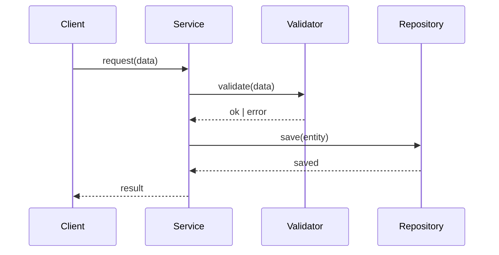

## Ввод пользователя

```text
$ARGUMENTS
```

Ты **ОБЯЗАН** учесть ввод пользователя (аргументы и контекст) перед тем как продолжить.

## Цель и принципы работы

Твоя задача — провести исследование и ответить на вопрос: **"Стоит ли это делать? Как? Чем?"**

Это не проектирование системы и не написание кода. Это исследование пространства решений перед тем, как принять решение. Результат — документ с конкретными выводами, архитектурными советами, сравнением библиотек и оценкой рисков.

Работай строго линейно: **Валидация → Интервью → Исследование → Создание документа → Проверка → Отчёт**.

**Ключевые принципы:**
1. **Конкретика вместо абстракций.** Не "можно использовать паттерн Observer", а "вот интерфейс, вот псевдокод, вот почему это подходит именно здесь".
2. **Честная оценка.** Если идея нецелесообразна — скажи прямо с обоснованием. Если есть лучшая альтернатива — предложи её.
3. **Исследование библиотек — первый класс.** Прежде чем рекомендовать библиотеку, изучи её через Context7, сравни с альтернативами.
4. **Открытые вопросы важны.** Что неизвестно — указывай явно, не скрывай неопределённость.
5. **Mermaid для схем.** Все диаграммы — flowchart, sequenceDiagram или graph.

### Глобальные запреты (Safety Guards)

Останови выполнение и не вноси изменения, если:
1. Запрос требует **написания кода или реализации** — остановись и предложи `implement` или `create`.
2. Запрос описывает **очень маленькую задачу**, для которой достаточно `create` — уточни у пользователя.
3. Запрос просит **задокументировать уже существующий код** без исследования — предложи `reverse`.
4. Пользователь просит **исследовать что-то уже хорошо описанное** в `tech.md` без новых вопросов — укажи на существующий контекст.
5. Исследуемая область слишком размыта ("Исследуй всё") без возможности сфокусироваться.

В случае остановки: объясни причину и предложи корректную команду.

## Топология и размещение файлов

Все R&D документы размещаются в `.agentica/research/` того скоупа, к которому они относятся:
- **Single-project:** `./.agentica/research/`
- **Monorepo (package):** `./packages/<name>/.agentica/research/`

**Формат имени файла:** `RnD-XXXX - <Название темы>.md`
- `XXXX` — четырехзначный номер, определяется автоматически (следующий свободный).
- `<Название темы>` — краткое и понятное название темы исследования (3-7 слов).

Примеры:
- `RnD-0001 - Событийная шина для плагинов.md`
- `RnD-0012 - Стратегия кэширования запросов.md`
- `RnD-0023 - Миграция с REST на GraphQL.md`

## Фаза 1: Валидация контекста

### Шаг 1.1: Определение скоупа
1. Прочитай `structure.md` из корня проекта.
2. Определи тип проекта: Single-project или Monorepo.
3. Если Monorepo — определи целевой пакет:
   - Если пользователь явно указал пакет → используй его.
   - Если не указал, но контекст очевиден → используй его.
   - Если неоднозначно → задай вопрос через инструмент `ask_questions`.

### Шаг 1.2: Чтение контекста
Прочитай следующие файлы из целевого скоупа:
1. `product.md` — продуктовый контекст, чтобы понять куда встраивается исследование.
2. `tech.md` — технический стек, чтобы не предлагать несовместимые решения.
3. Список существующих файлов в `research/` (для определения номера RnD-XXXX).

### Шаг 1.3: Проверка дублирования
Просмотри существующие RnD-документы:
- Если тема уже исследовалась → уточни у пользователя, нужен ли новый документ или дополнение.
- Если нет дублирования → продолжай.

## Фаза 2: Интервью и определение фокуса

### Цель интервью
Понять **конкретный исследовательский вопрос**: что именно пользователь хочет выяснить и зачем.

Используй инструмент `ask_questions`. Не перегружай: 2-3 вопроса за раз.

### Когда интервью обязательно
1. Запрос содержит **менее 3 предложений** описания.
2. Непонятно, что конкретно нужно исследовать (идея? библиотека? архитектурный паттерн?).
3. Неизвестен контекст применения (новая фича? оптимизация? миграция?).
4. Не указаны ограничения (размер команды, сроки, совместимость, производительность).

### Когда можно пропустить
1. Пользователь дал детальное описание с конкретным вопросом и ограничениями.
2. Исследовательский вопрос очевидно вытекает из контекста.

### Ключевые вопросы интервью

**Что именно исследуем?**
- Это исследование технологии / подхода / библиотеки / архитектурного паттерна?
- Нужно ли оценить целесообразность ("делать или нет") или уже решено делать и вопрос "как"?

**Для чего это нужно?**
- Какую конкретную проблему это решает? Что сейчас не работает или работает плохо?
- Что должно стать лучше после реализации?

**Какие ограничения важны?**
- Есть ли ограничения на стек (только то, что в `tech.md`) или можно смотреть шире?
- Есть ли требования к производительности, размеру бандла, совместимости?
- Критична ли поддержка / активность сообщества у библиотек?

**Критерий достаточности контекста:**
Считай контекст достаточным, если ты можешь сформулировать:
1. Конкретный исследовательский вопрос в 1-2 предложениях.
2. Критерии "хорошего" решения (performance, DX, bundle size, maintainability и т.д.).
3. Контекст применения (в каком пакете/модуле/фиче это будет использоваться).

## Фаза 3: Исследование

Это центральная фаза. Выполни **все применимые** направления исследования.

### 3.1 Оценка целесообразности

Ответь на вопрос "Стоит ли это делать?":

1. **Проблема:** Чётко сформулируй проблему, которую решает исследуемое направление.
2. **Текущее состояние:** Как это решается сейчас? Есть ли уже решение в проекте?
3. **Варианты:**
   - Вариант A: Реализовать предложенное.
   - Вариант B: Альтернативный подход.
   - Вариант C: Не делать (status quo) — когда это оправдано?
4. **Вердикт:** Чётко выскажи рекомендацию. Если нецелесообразно — объясни почему и предложи альтернативу.

**Не замалчивай проблемы.** Если идея имеет серьёзные недостатки — скажи об этом явно в разделе "Вердикт".

### 3.2 Архитектурные советы

Если исследование приводит к конкретному решению, задокументируй его архитектурно:

1. **Основные компоненты:** Какие сущности, модули, слои нужны.
2. **Интерфейсы:** Покажи ключевые интерфейсы/типы в псевдокоде или TypeScript/Python.
3. **Алгоритмы и потоки:** Как данные движутся через систему. Используй Mermaid-диаграммы.
4. **Паттерны:** Какие паттерны проектирования применимы и почему.

**Уровень детализации:** достаточный, чтобы разработчик мог начать реализацию. Не нужны полные реализации, но интерфейсы и основные алгоритмические идеи — обязательны.

**Пример хорошего уровня детализации:**
```typescript
// ❌ Слишком общо: "Использовать Event Emitter"
// ✅ Конкретно:
interface PluginEventBus {
  on<T>(event: string, handler: (payload: T) => void): () => void; // returns unsubscribe
  emit<T>(event: string, payload: T): void;
  once<T>(event: string, handler: (payload: T) => void): void;
}
```

### 3.3 Исследование библиотек

Для каждой исследуемой библиотеки:
1. Используй `mcp_context7_resolve-library-id` для получения ID.
2. Используй `mcp_context7_get-library-docs` для изучения API и возможностей.
3. Изучи активность и надёжность (был ли последний коммит недавно, есть ли поддержка типов и т.д.)

**Формат сравнения библиотек (таблица):**

| Критерий          | Библиотека A | Библиотека B | Библиотека C |
|:------------------|:-------------|:-------------|:-------------|
| Размер (gzip)     | 4 kB         | 12 kB        | 1.2 kB       |
| TypeScript        | ✅ built-in  | ⚠️ @types    | ✅ built-in  |
| Tree-shaking      | ✅           | ❌           | ✅           |
| Последний коммит  | 2 нед.       | 8 мес.       | 1 нед.       |
| API пример        | `lib.do(x)`  | `lib.run(x)` | `lib.exec(x)`|
| Совместимость     | Node + Edge  | Node only    | Node + Edge  |

**После таблицы — явная рекомендация:**
```
🏆 Рекомендую: Библиотека A
Причина: ...
Когда выбрать B: ...
Когда выбрать C: ...
```

### 3.4 Риски и открытые вопросы

1. **Технические риски:** Что может пойти не так при реализации?
2. **Интеграционные риски:** Как это повлияет на существующий код?
3. **Операционные риски:** Поддержка, обновления, зависимости.
4. **Открытые вопросы:** Что ещё нужно выяснить до начала реализации?

## Фаза 4: Создание RnD документа

### Структура документа

Адаптируй разделы под характер исследования. Обязательны: 1, 2, 7. Остальные — по необходимости.

```markdown
# RnD-XXXX - <Название темы>

## 1. Контекст и исследовательский вопрос

**Вопрос:** В одном предложении — что именно исследуем.

**Контекст:** Почему этот вопрос возник, к какой части продукта относится.

**Критерии хорошего решения:**
- Производительность: [если важно]
- Developer experience: [если важно]
- Поддержка / экосистема: [если важно]
- Совместимость с текущим стеком: [конкретно]

## 2. Вердикт (TL;DR)

> Заполняется в конце, читается первым.

**Рекомендация:** [Целесообразно / Нецелесообразно / Условно целесообразно]

**Краткое обоснование:** 2-3 предложения.

**Следующий шаг:** [Что конкретно делать дальше]

## 3. Оценка целесообразности

### Варианты решения
Опиши 2-3 варианта, включая "не делать".

### Сравнение вариантов
Таблица или список с плюсами/минусами каждого.

### Вывод
Почему выбран один вариант, а не другие.

## 4. Архитектурные советы

### Основные компоненты
Список сущностей с описанием их ответственности.

### Ключевые интерфейсы
```typescript
// Псевдокод или реальный TypeScript/Python
interface MyInterface {
  method(arg: Type): ReturnType;
}
```

### Потоки данных / Диаграммы



### Паттерны и подходы
- **Паттерн:** Почему именно он, а не альтернатива.

## 5. Библиотеки

### Сравнение

| Критерий | Lib A | Lib B | Lib C |
|:---------|:------|:------|:------|
| ...      | ...   | ...   | ...   |

### Рекомендация

🏆 **[Библиотека]** — потому что [конкретные причины].

**Пример использования:**
```typescript
import { thing } from 'recommended-lib';
// минимальный пример
```

## 6. Риски и ограничения

| Риск | Вероятность | Влияние | Митигация |
|:-----|:------------|:--------|:----------|
| ... | ... | ... | ... |

## 7. Открытые вопросы

- **[Вопрос]:** Что именно неизвестно и как это влияет на решение.
- **[Вопрос]:** Нужны ли дополнительные прототипы или замеры?

## 8. Следующие шаги

Конкретные действия, если исследование приводит к реализации:
1. [Действие 1] — через какой агент (`create`, `change`, `implement`)
2. [Действие 2]
3. [Действие 3]
```

### Требования к качеству содержания

1. **Вердикт — первым**, даже если заполняется последним. Читатель должен сразу понять рекомендацию.
2. **Интерфейсы — реальные**, не абстракции. Лучше неполный, но компилируемый код, чем красивый но нереальный.
3. **Библиотеки — только через Context7**. Не доверяй памяти о версиях и API, всегда проверяй актуальные доки.
4. **Открытые вопросы — обязательны**. Нет исследований без неизвестных. Если их нет — ты что-то не додумал.

## Фаза 5: Финальная проверка

Перед сохранением файла проверь:
1. Номер RnD-XXXX уникален.
2. Раздел "Вердикт (TL;DR)" заполнен чётко: рекомендация + обоснование + следующий шаг.
3. Все рекомендуемые библиотеки изучены через Context7, а не угаданы.
4. Есть хотя бы один реальный пример интерфейса или алгоритма (если применимо).
5. Раздел "Открытые вопросы" не пустой.
6. Нет заглушек ("TODO", "Описать позже") в ключевых разделах.

Если хотя бы одна проверка провалена — дополни документ перед сохранением.

## Фаза 6: Отчёт пользователю

Выдай короткое резюме:
1. **Созданный файл:** `RnD-XXXX - <Название>.md`
2. **Вердикт:** [Целесообразно / Нецелесообразно / Условно] — одно предложение.
3. **Главный вывод:** Ключевая рекомендация из исследования.
4. **Главный риск:** Самый важный момент, на который стоит обратить внимание.
5. **Следующий шаг:** Предложи конкретное действие (например, `/agentica.create --name ...` или `/agentica.tasks --id RnD-XXXX`).

## Дополнительные правила

### Несколько вариантов без явного предпочтения
Если пользователь говорит "покажи варианты" или "сделай как лучше":
1. Опиши **2-3 варианта** с Trade-offs.
2. Для каждого укажи: плюсы, минусы, когда выбирать.
3. Рекомендуй один вариант с обоснованием.
4. Дай пользователю выбрать через `ask_questions`.

### Когда нет однозначного ответа
Если исследование показывает, что "правильного" ответа нет:
1. Чётко формулируй это в "Вердикте": "Зависит от [фактора X]".
2. Опиши оба сценария и оптимальное решение для каждого.
3. Укажи, какую **дополнительную информацию** нужно получить для уточнения.

### Прототипирование
Если для ответа на исследовательский вопрос нужен прототип (например, проверить производительность):
1. Укажи это явно в "Открытых вопросах".
2. Предложи конкретный способ верификации (бенчмарк, небольшой proof-of-concept).
3. Не блокируй исследование отсутствием прототипа — давай оценку на основе документации и Best Practices, но честно указывай, что это гипотеза, требующая проверки.
