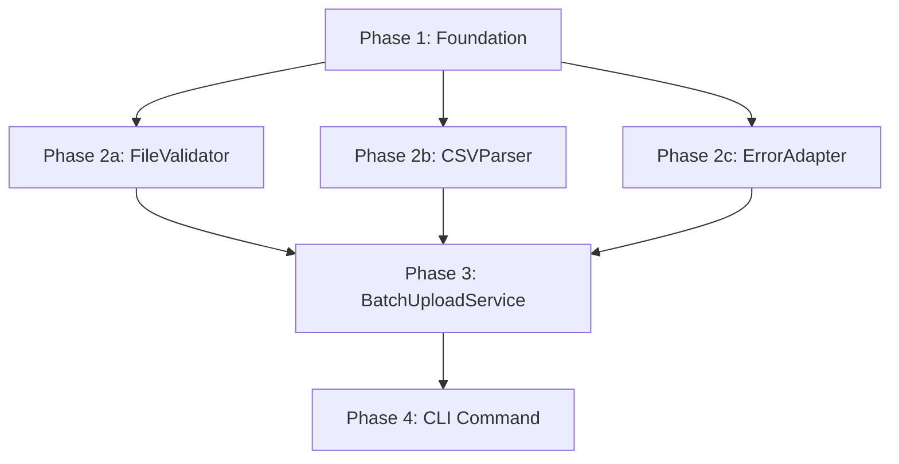
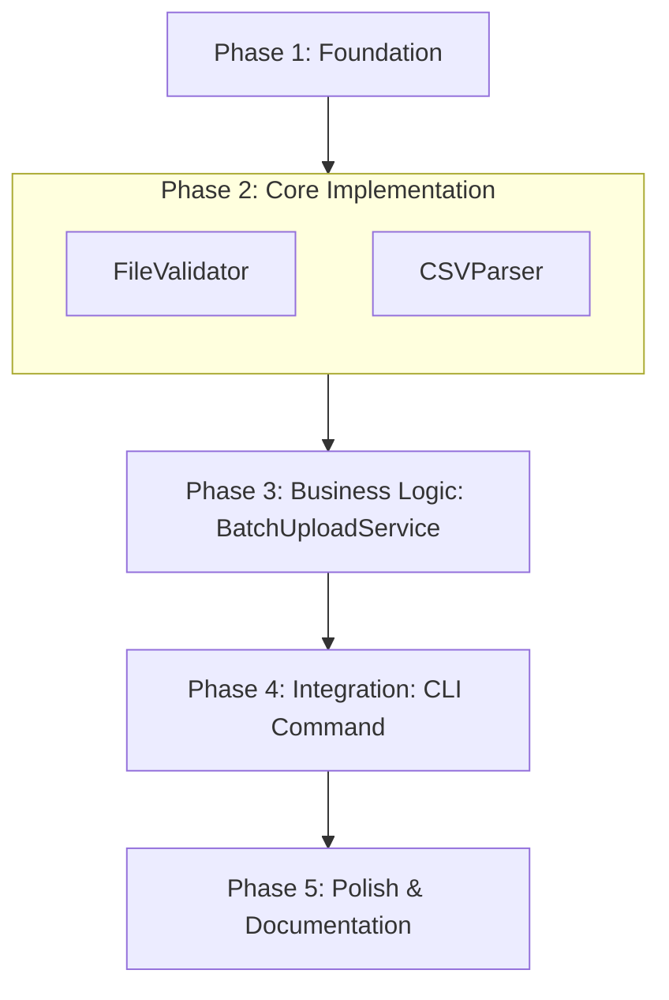

## Ввод пользователя

```text
$ARGUMENTS
```

Ты **ОБЯЗАН** учесть ввод пользователя (аргументы и контекст) перед тем как продолжить.

## Цель и принципы работы

Твоя задача — декомпозировать готовую спецификацию фичи (FT-XXXX) на **реализуемый план работ**.
Работай строго линейно: **Валидация → Чтение спеки → Анализ → Планирование фаз → Декомпозиция задач → Валидационные критерии → Пауза для review → Git → Отчёт**.

Хороший план задач — это не просто "список дел", а **пошаговая инструкция для агента-разработчика**, которая обеспечивает:
- **Правильный порядок:** Нельзя сделать B до того, как сделан A.
- **Атомарность:** Каждая задача — это 1 файл или группа связанных изменений.
- **Проверяемость:** После каждой задачи должно быть понятно, что считать "готово".
- **Фазовость:** Код должен оставаться в валидном состоянии после каждой фазы.

**Ключевые принципы:**
1. **Incremental Delivery:** Код работоспособен после каждой фазы, не только в конце.
2. **Memory для структуры:** Используй `memory` для накопления фактов о зависимостях между задачами.
3. **Graph of Dependencies:** Явно обозначай зависимости между фазами (диаграмма).
4. **Test-Driven Planning:** Каждая фаза должна завершаться задачей "написать тесты для фазы N".
5. **Checkpoint перед реализацией:** Пользователь должен одобрить план до того, как запустится `agentica.implement`.

### Глобальные запреты (Safety Guards)

Останови выполнение и не продолжай работу, если:
1. Спецификация FT-XXXX **не существует** (используй `agentica.create` для создания).
2. Спецификация FT-XXXX **неполная** (`product.md` или `tech.md` отсутствуют или содержат только заглушки).
3. Запрос требует **создания новой фичи**, а не планирования существующей (используй `agentica.create`).
4. Запрос требует **изменения существующего кода**, а не добавления нового (используй `agentica.change` → `agentica.tasks` для CH-XXXX).
5. Запрос требует **написания кода** напрямую (сначала нужен план через `agentica.tasks`, затем `agentica.implement`).
6. `tasks.md` уже заполнен и пользователь не просил его переписать (предложи `agentica.iterate` для правок).

В случае остановки: объясни причину и предложи корректную команду.

## Топология и размещение файлов

Спецификация фичи состоит из набора документов в директории `.agentica/features/FT-XXXX - <Название>/`:

```
FT-XXXX - <Название фичи>/
├── product.md       # Продуктовое описание (ЧТО и ЗАЧЕМ) — уже создан
├── tech.md          # Техническое решение (КАК) — уже создан
├── research.md      # Исследование библиотек (опционально) — может быть создан
├── tasks.md         # Задачи для реализации — ЗАПОЛНЯЕТСЯ ЭТОЙ КОМАНДОЙ
└── validation.md    # Критерии приемки — ДОПОЛНЯЕТСЯ ЭТОЙ КОМАНДОЙ
```

**Git workflow:**
- На момент выполнения команды уже существует ветка вида `<scope-id>/FT-XXXX-<slug>`.
- Все изменения делаются в этой ветке.
- После завершения работы делается коммит с сообщением: `chore(FT-XXXX): add implementation tasks and validation criteria`.

## Фаза 1: Валидация контекста и определение скоупа

### Шаг 1.1: Поиск спецификации FT-XXXX

Определи номер целевой спецификации:

**Вариант A: Явное указание в аргументах**
```text
/agentica.tasks --id FT-0012
```
→ Используй `FT-0012`

**Вариант B: Из контекста ветки**
1. Прочитай текущую git ветку через `run_in_terminal`: `git branch --show-current`
2. Извлеки номер из паттерна `<scope-id>/FT-XXXX-<slug>` (например, `api-client/FT-0012-batch-upload` → `FT-0012`)

**Вариант C: Из открытого файла**
1. Проверь путь открытого файла в editorContext.
2. Если он содержит `.agentica/features/FT-XXXX`, извлеки номер.

**Вариант D: Интерактивный выбор**
Если контекста недостаточно:
1. Просканируй `.agentica/features/` (или `./packages/<name>/.agentica/features/`).
2. Найди все директории вида `FT-XXXX - <название>`.
3. Задай вопрос через `ask_questions` со списком найденных спек.

### Шаг 1.2: Определение скоупа проекта

1. Прочитай `structure.md` из корня проекта.
2. Определи тип проекта: Single-project или Monorepo.
3. Определи путь к целевой спецификации:
   - **Single-project:** `./.agentica/features/FT-XXXX - <название>/`
   - **Monorepo:** `./packages/<name>/.agentica/features/FT-XXXX - <название>/`

### Шаг 1.3: Проверка наличия спецификации

Проверь наличие обязательных файлов:
1. `product.md` — **ОБЯЗАТЕЛЬНО**. Если отсутствует или пустой — STOP (используй `agentica.create`).
2. `tech.md` — **ОБЯЗАТЕЛЬНО**. Если отсутствует или пустой — STOP (используй `agentica.create`).
3. `research.md` — опционально, но если существует — прочитай.
4. `tasks.md` — если уже заполнен и пользователь не просил переписать → STOP (используй `agentica.iterate`).

Если проверка пройдена — переходи к Фазе 2.

## Фаза 2: Чтение и анализ спецификации

### Шаг 2.1: Чтение продуктовой спецификации (product.md)

Прочитай `product.md` полностью и извлеки:

**Продуктовый контекст:**
- Для кого фича? (целевая аудитория)
- Зачем фича? (продуктовая мотивация)
- Что должно получиться? (ожидаемый результат)

**User Stories:**
- Список всех пользовательских сценариев
- Критерии приемки для каждого сценария
- Приоритеты (если указаны)

**Ограничения и риски:**
- Продуктовые ограничения (производительность, UX требования)
- Известные риски

Сохрани ключевые факты в `memory`:
```
category: general
subject: @<scope>/FT-XXXX--product
fact: User story: Admin uploads CSV file up to 100MB via CLI command
citations: product.md:45-52
reason: This defines scope boundary for implementation. Need to add file size validation task.
```

### Шаг 2.2: Чтение технической спецификации (tech.md)

Прочитай `tech.md` полностью и извлеки:

**Архитектурные решения:**
- Какие модули/компоненты нужно создать?
- Какие интерфейсы/контракты определены?
- Какие паттерны используются?

**Технический стек:**
- Какие библиотеки нужно использовать?
- Какие уже существующие модули нужно интегрировать?
- Какие технологии применяются?

**Структура файлов:**
- Где должны располагаться новые файлы?
- Какая иерархия модулей?

**Интеграционные точки:**
- С какими существующими модулями нужна интеграция?
- Какие API/интерфейсы нужно реализовать?

Сохрани структурные факты в `memory`:
```
category: file_specific
subject: @<scope>/FT-XXXX--structure
fact: BatchUploadService depends on FileValidator and CSVParser modules
citations: tech.md:123-145
reason: FileValidator and CSVParser must be implemented before BatchUploadService. Defines task order.
```

```
category: general
subject: @<scope>/FT-XXXX--integration
fact: Must integrate with existing ErrorHandler for consistent error reporting
citations: tech.md:234-240
reason: Need task to adapt errors from new modules to ErrorHandler format. Integration point.
```

### Шаг 2.3: Чтение исследования (research.md, если существует)

Если `research.md` существует, прочитай его и извлеки:
- Какие библиотеки выбраны и почему?
- Какие альтернативы были отвергнуты?
- Какие ограничения библиотек нужно учесть?

Сохрани в `memory` факты о библиотеках:
```
category: general
subject: @<scope>/FT-XXXX--libraries
fact: Using papaparse for CSV parsing, max file size limited to 100MB by memory constraints
citations: research.md:67-89
reason: Need to add validation task for file size before parsing. Library limitation affects design.
```

### Шаг 2.4: Чтение контекста проекта/пакета

Прочитай дополнительные контекстные файлы из скоупа:
1. `structure.md` — структура проекта/пакета
2. `tech.md` (проектный) — общие технические стандарты
3. `AGENTS.codestyle.md` (если есть в корне) — правила качества кода

Извлеки:
- Где должны располагаться новые файлы? (директории, naming conventions)
- Какие code style правила нужно соблюдать?
- Какие testing frameworks используются?

## Фаза 3: Анализ зависимостей и определение фаз

### Шаг 3.1: Построение графа зависимостей компонентов

На основе `tech.md` составь граф зависимостей всех компонентов фичи:

**Пример:**
```
FileValidator (независимый)
CSVParser (независимый)
ErrorAdapter (зависит от existing ErrorHandler)
BatchUploadService (зависит от FileValidator, CSVParser)
CLI Command (зависит от BatchUploadService)
```

Сохрани граф в `memory`:
```
category: general
subject: @<scope>/FT-XXXX--dependencies
fact: Dependency chain: FileValidator → BatchUploadService → CLI Command
citations: tech.md analysis
reason: Defines implementation order. Cannot implement CLI before BatchUploadService is ready.
```

### Шаг 3.2: Определение фаз реализации

Группируй компоненты в **фазы** по следующим принципам:

**Принцип 1: Независимость**
Компоненты без зависимостей (или зависящие только от существующего кода) идут в **Фазу 1 (Foundation)**.

**Принцип 2: Уровни абстракции**
- Низкоуровневые утилиты и базовые структуры → **Фаза 2 (Core)**
- Бизнес-логика → **Фаза 3 (Business Logic)**
- Интеграции и UI/CLI → **Фаза 4 (Integration)**

**Принцип 3: Тестируемость**
Каждая фаза должна быть полностью тестируема независимо от следующих фаз.

**Принцип 4: Incremental Delivery**
После каждой фазы код должен:
- Компилироваться без ошибок
- Проходить все существующие тесты
- Проходить новые тесты для текущей фазы

**Стандартная структура фаз:**

```
Phase 1: Foundation (Подготовка инфраструктуры)
  - Создание директорий и базовых файлов
  - Определение интерфейсов и типов
  - Установка и настройка зависимостей
  - Написание каркаса без реализации

Phase 2: Core Implementation (Независимые компоненты)
  - Реализация утилит без внешних зависимостей
  - Базовые валидаторы, парсеры, адаптеры
  - Unit-тесты для каждого компонента

Phase 3: Business Logic (Основная логика)
  - Реализация сервисов, использующих Core компоненты
  - Оркестрация и координация между модулями
  - Integration тесты для бизнес-логики

Phase 4: Integration (Интеграция с системой)
  - CLI команды, HTTP handlers, UI компоненты
  - Интеграция с существующими модулями
  - Error handling и логирование
  - E2E тесты

Phase 5: Polish & Documentation (Финализация)
  - Оптимизация производительности
  - Улучшение сообщений об ошибках
  - Написание документации (README, примеры)
  - Обновление CHANGELOG
```

Адаптируй эту структуру под специфику фичи. Для простых фич может быть 2-3 фазы, для сложных — 5-7.

### Шаг 3.3: Создание диаграммы зависимостей фаз

Создай текстовую диаграмму, показывающую порядок выполнения фаз:

**Для последовательных фаз:**


**Для частично параллельных фаз:**


Сохрани структуру фаз в `memory`:
```
category: general
subject: @<scope>/FT-XXXX--phases
fact: 5 sequential phases: Foundation → Core → Business → Integration → Polish
citations: Dependency analysis
reason: Will structure tasks.md sections. Each phase is a checkpoint with tests.
```

## Фаза 4: Декомпозиция фаз на атомарные задачи

### Шаг 4.1: Правила декомпозиции задач

**Что такое "атомарная задача"?**
- **Один артефакт:** Создание/изменение 1 файла или группы тесно связанных файлов.
- **Одна функция:** Реализация одного метода, класса, функции, или небольшой группы связанных функций.
- **Проверяемость:** Понятно, когда задача выполнена (файл создан, тесты проходят, функция работает).
- **Время выполнения:** 10-30 минут на задачу для человека (1-5 минут для агента).

**Плохая задача (слишком размыто):**
```
- [ ] Реализовать загрузку файлов
```

**Хорошая задача (атомарно):**
```
- [ ] TSK-2-003: Создать FileValidator с методом validateSize(file: File): boolean
- [ ] TSK-2-004: Добавить валидацию MIME-типа в FileValidator.validateType(file: File): boolean
- [ ] TSK-2-005: Написать unit-тесты для FileValidator (5 test cases)
```

**Нумерация задач:**
Формат: `TSK-<PhaseNumber>-<TaskNumber>`
- `PhaseNumber` — номер фазы (1, 2, 3...)
- `TaskNumber` — номер задачи внутри фазы (001, 002, 003...)

Примеры:
- `TSK-1-001` — первая задача первой фазы
- `TSK-3-012` — двенадцатая задача третьей фазы

### Шаг 4.2: Типы задач

**Тип 1: Создание структуры (Scaffolding)**
```
- [ ] TSK-1-001: Создать директорию src/upload/ и src/upload/validators/
- [ ] TSK-1-002: Создать файл src/upload/types.ts с интерфейсами UploadOptions и UploadResult
```

**Тип 2: Реализация интерфейса/класса**
```
- [ ] TSK-2-003: Реализовать класс FileValidator в src/upload/validators/file-validator.ts
- [ ] TSK-2-004: Реализовать метод validateSize() в FileValidator
- [ ] TSK-2-005: Реализовать метод validateType() в FileValidator
```

**Тип 3: Интеграция модулей**
```
- [ ] TSK-3-008: Интегрировать FileValidator в BatchUploadService
- [ ] TSK-3-009: Добавить обработку ошибок валидации через ErrorHandler
```

**Тип 4: Тестирование**
```
- [ ] TSK-2-010: Написать unit-тесты для FileValidator (5 test cases: size ok, size exceeded, valid MIME, invalid MIME, edge cases)
- [ ] TSK-3-015: Написать integration-тесты для BatchUploadService (3 scenarios: success, validation error, parser error)
```

**Тип 5: Документация**
```
- [ ] TSK-5-020: Добавить JSDoc комментарии для публичного API BatchUploadService
- [ ] TSK-5-021: Создать примеры использования в docs/examples/batch-upload.md
```

**Тип 6: Git Checkpoint**
```
- [ ] TSK-2-011: Git commit: "feat(upload): add FileValidator with size and type validation"
- [ ] TSK-3-016: Git commit: "feat(upload): implement BatchUploadService with error handling"
```

### Шаг 4.3: Декомпозиция каждой фазы

Для каждой фазы:

1. **Составь список артефактов:**
   - Какие файлы нужно создать?
   - Какие интерфейсы/классы/функции реализовать?

2. **Определи порядок реализации:**
   - Какие компоненты независимы (можно делать параллельно)?
   - Какие зависят друг от друга (строгий порядок)?

3. **Добавь задачи на тестирование:**
   - После каждого компонента — unit-тесты
   - В конце фазы — integration/e2e тесты

4. **Добавь Git checkpoint:**
   - В конце фазы — коммит с описанием сделанного

**Пример декомпозиции Phase 2 (Core Implementation):**

Компоненты Phase 2: FileValidator, CSVParser

```markdown
## Phase 2: Core Implementation (Независимые компоненты)

**Checkpoint:** После этой фазы: FileValidator и CSVParser полностью реализованы и протестированы, готовы к использованию в BatchUploadService.

### FileValidator

- [ ] TSK-2-001: Создать src/upload/validators/file-validator.ts с классом FileValidator
- [ ] TSK-2-002: Реализовать конструктор FileValidator(options: ValidatorOptions)
- [ ] TSK-2-003: Реализовать метод validateSize(file: File): ValidationResult
- [ ] TSK-2-004: Реализовать метод validateType(file: File): ValidationResult
- [ ] TSK-2-005: Реализовать метод validate(file: File): ValidationResult (объединяет все проверки)
- [ ] TSK-2-006: Написать unit-тесты для FileValidator (tests/upload/validators/file-validator.test.ts):
  - Test: validateSize возвращает success для файла 50MB (лимит 100MB)
  - Test: validateSize возвращает error для файла 150MB (лимит 100MB)
  - Test: validateType возвращает success для text/csv
  - Test: validateType возвращает error для application/json
  - Test: validate возвращает error если хотя бы одна проверка failed

### CSVParser

- [ ] TSK-2-007: Создать src/upload/parsers/csv-parser.ts с классом CSVParser
- [ ] TSK-2-008: Реализовать конструктор CSVParser(options: ParserOptions)
- [ ] TSK-2-009: Реализовать метод parse(content: string): ParseResult<Row[]>
- [ ] TSK-2-010: Добавить обработку ошибок парсинга (malformed CSV, encoding issues)
- [ ] TSK-2-011: Написать unit-тесты для CSVParser (tests/upload/parsers/csv-parser.test.ts):
  - Test: parse возвращает массив объектов для валидного CSV
  - Test: parse обрабатывает CSV с quoted strings
  - Test: parse возвращает ошибку для malformed CSV
  - Test: parse корректно определяет delimiter (comma vs semicolon)
  - Test: parse обрабатывает empty файл

### Checkpoint

- [ ] TSK-2-012: Проверить что все тесты фазы 2 проходят: `bun test -- tests/upload/validators/ tests/upload/parsers/`
- [ ] TSK-2-013: Git commit: "feat(upload): implement FileValidator and CSVParser with full test coverage"
```

### Шаг 4.4: Сохранение структуры задач в Memory

Для каждой фазы сохрани в `memory` список задач:

```
category: general
subject: @<scope>/FT-XXXX--phase2-tasks
fact: Phase 2 has 13 tasks: FileValidator (6), CSVParser (5), Checkpoint (2)
citations: Task breakdown analysis
reason: Will be used for progress tracking in implement phase. Each task is atomic unit.
```

## Фаза 5: Заполнение tasks.md

### Шаг 5.1: Чтение шаблона tasks.md

Прочитай шаблон из `.agentica/templates/feature/FT-0000 - Название фичи или модуля XXX/tasks.md`.

### Шаг 5.2: Структура документа tasks.md

Документ состоит из следующих разделов:

```markdown
# FT-XXXX - Список задач - <Название фичи>

Документы:
- [Продуктовое описание - <Название>](../product.md)
- [Тех-задание <Название>](../tech.md)
- [Чек-лист для валидации <Название>](../validation.md)
- [Исследование библиотек <Название>](../research.md) <!-- если есть -->

---

## Фазы реализации

<Список фаз с кратким описанием>

---

## Диаграмма зависимостей фаз

<Mermaid диаграмма, показывающая порядок выполнения>

---

## Phase 1: <Название фазы>

**Checkpoint:** <Критерий завершения фазы>

<Список задач TSK-1-001, TSK-1-002...>

---

## Phase 2: <Название фазы>

...
```

### Шаг 5.3: Заполнение списка фаз

Перепиши секцию "Фазы реализации" на основе данных из Фазы 3:

````markdown
## Фазы реализации

- **Phase 1: Foundation (Подготовка инфраструктуры)** — создание директорий, интерфейсов, установка зависимостей
- **Phase 2: Core Implementation (Независимые компоненты)** — реализация FileValidator, CSVParser с тестами
- **Phase 3: Business Logic (Основная логика)** — реализация BatchUploadService, интеграция компонентов
- **Phase 4: Integration (Интеграция с системой)** — CLI команда, error handling, e2e тесты
- **Phase 5: Polish & Documentation (Финализация)** — оптимизация, документация, примеры
````

### Шаг 5.4: Заполнение диаграммы зависимостей

Вставь диаграмму из Шага 3.3:

````markdown
## Диаграмма зависимостей фаз


````

### Шаг 5.5: Заполнение задач каждой фазы

Для каждой фазы создай раздел с:
1. **Заголовок:** `## Phase N: <Название>`
2. **Checkpoint:** Критерий завершения фазы (что должно работать после фазы)
3. **Группировка задач:** Если в фазе несколько компонентов, группируй задачи по компонентам (подзаголовки `### КомпонентName`)
4. **Список задач:** Каждая задача в формате `- [ ] TSK-N-XXX: <Описание>`

**Пример:**

```markdown
## Phase 2: Core Implementation (Независимые компоненты)

**Checkpoint:** После этой фазы FileValidator и CSVParser полностью реализованы и протестированы, готовы к использованию в BatchUploadService. Все unit-тесты проходят.

### FileValidator

- [ ] TSK-2-001: Создать src/upload/validators/file-validator.ts с классом FileValidator
- [ ] TSK-2-002: Реализовать конструктор FileValidator(options: ValidatorOptions)
- [ ] TSK-2-003: Реализовать метод validateSize(file: File): ValidationResult
- [ ] TSK-2-004: Реализовать метод validateType(file: File): ValidationResult
- [ ] TSK-2-005: Реализовать метод validate(file: File): ValidationResult
- [ ] TSK-2-006: Написать unit-тесты для FileValidator (5 test cases)

### CSVParser

- [ ] TSK-2-007: Создать src/upload/parsers/csv-parser.ts с классом CSVParser
- [ ] TSK-2-008: Реализовать конструктор CSVParser(options: ParserOptions)
- [ ] TSK-2-009: Реализовать метод parse(content: string): ParseResult<Row[]>
- [ ] TSK-2-010: Добавить обработку ошибок парсинга (malformed CSV, encoding issues)
- [ ] TSK-2-011: Написать unit-тесты для CSVParser (5 test cases)

### Phase Checkpoint

- [ ] TSK-2-012: Проверить что все тесты фазы 2 проходят: `bun test -- tests/upload/validators/ tests/upload/parsers/`
- [ ] TSK-2-013: Git commit: "feat(upload): implement FileValidator and CSVParser with full test coverage"
```

### Шаг 5.6: Создание/обновление tasks.md

Если `tasks.md` еще не существует:
1. Создай файл `<path-to-FT-XXXX>/tasks.md`
2. Заполни его согласно шагам 5.3-5.5

Если `tasks.md` существует (пустой или с заглушками):
1. Замени содержимое на новое

## Фаза 6: Дополнение validation.md специфичными критериями

### Шаг 6.1: Чтение шаблона validation.md

Прочитай существующий `<path-to-FT-XXXX>/validation.md`.

Шаблон уже содержит:
- **Инструментальную проверку** (VAL-001 до VAL-010) — стандартные проверки (тесты, линтер, компиляция)
- **Семантическую проверку** (VAL-101 до VAL-113) — общие критерии качества

### Шаг 6.2: Добавление фича-специфичных критериев

На основе `product.md` и `tech.md` добавь **дополнительные критерии** в конец документа.

**Категории дополнительных критериев:**

**A. Продуктовые критерии (Feature-specific acceptance)**
Проверки, специфичные для этой фичи:

```markdown
## Фича-специфичная валидация

### Продуктовые критерии (Feature Acceptance)

- [ ] VAL-201: Команда `batch-upload` должна принимать путь к директории и загружать все CSV файлы из неё
- [ ] VAL-202: Файлы размером более 100MB должны отклоняться с понятным сообщением об ошибке
- [ ] VAL-203: После загрузки должен выводиться отчёт с количеством успешных/неуспешных файлов
- [ ] VAL-204: При ошибке парсинга CSV должна выводиться информация о строке с ошибкой
```

**B. Технические критерии (Implementation-specific)**
Проверки архитектурных решений из `tech.md`:

```markdown
### Технические критерии (Implementation)

- [ ] VAL-301: FileValidator должен быть переиспользуемым и не зависеть от BatchUploadService
- [ ] VAL-302: CSVParser должен использовать библиотеку papaparse согласно tech.md
- [ ] VAL-303: Ошибки из FileValidator и CSVParser должны оборачиваться через ErrorHandler для единообразия
- [ ] VAL-304: BatchUploadService должен поддерживать dependency injection для FileValidator и CSVParser (для тестируемости)
```

**C. Интеграционные критерии (Integration points)**
Проверки интеграций с существующими модулями:

```markdown
### Интеграционные критерии (Integration)

- [ ] VAL-401: CLI команда должна использовать существующий CommandRunner без дублирования логики
- [ ] VAL-402: Логирование должно использовать существующий Logger, не console.log
- [ ] VAL-403: Конфигурация лимитов (размер файла) должна читаться из config.ts, не хардкодиться
```

**D. Performance критерии (если указаны в product.md/tech.md)**

```markdown
### Производительность (Performance)

- [ ] VAL-501: Загрузка 10 файлов по 50MB каждый должна занимать не более 30 секунд
- [ ] VAL-502: Парсинг CSV с 100k строк должен занимать не более 5 секунд
- [ ] VAL-503: Пиковое потребление памяти при загрузке 100MB файла не должно превышать 300MB
```

### Шаг 6.3: Нумерация дополнительных критериев

Используй следующую нумерацию:
- **VAL-2XX** — Продуктовые критерии (Feature Acceptance)
- **VAL-3XX** — Технические критерии (Implementation)
- **VAL-4XX** — Интеграционные критерии (Integration)
- **VAL-5XX** — Производительность (Performance)
- **VAL-6XX** — Безопасность (Security), если применимо
- **VAL-7XX** — Accessibility/UX (если применимо для GUI)

### Шаг 6.4: Обновление validation.md

Добавь новый раздел в конец `validation.md`:

```markdown
## Фича-специфичная валидация

<Все критерии из Шага 6.2>
```

Не удаляй существующие разделы "Инструментальная проверка" и "Семантическая проверка".

## Фаза 7: Интерактивная проверка с пользователем

### Шаг 7.1: Формирование сводки

Создай краткую сводку проделанной работы:

```markdown
## Сводка планирования

**Спецификация:** FT-XXXX - <Название фичи>

**Фазы реализации:** <N> фаз
1. Phase 1: <Название> — <количество задач>
2. Phase 2: <Название> — <количество задач>
3. ...

**Всего задач:** <N>

**Особенности:**
- <Любые важные замечания о плане>
- <Риски или области, требующие внимания>
- <Зависимости от внешних библиотек>

**Дополнительные критерии валидации:** <N> критериев добавлено в validation.md
```

### Шаг 7.2: Запрос на review

Выведи сообщение пользователю:

```
Я создал план реализации для FT-XXXX. 

**Структура:**
- X фаз реализации
- Y атомарных задач
- Z дополнительных критериев валидации

**Ключевые решения:**
- [Опиши 2-3 ключевых архитектурных решения в плане]

Пожалуйста, проверь [tasks.md](path/to/tasks.md) и [validation.md](path/to/validation.md).

Если всё устраивает, напиши "продолжай" и я закоммичу изменения.
Если нужны правки — опиши, что изменить.
```

### Шаг 7.3: Обработка фидбека

**Если пользователь ответил "продолжай" (или эквивалент):**
→ Переходи к Фазе 8 (Git commit)

**Если пользователь запросил изменения:**
1. Внеси правки в `tasks.md` и/или `validation.md`
2. Повтори Шаг 7.2 (запрос на review)

**Если пользователь запросил масштабные изменения (например, "переделай полностью"):**
→ Вернись к Фазе 3 (пересмотр фаз) или Фазе 4 (пересмотр задач)

## Фаза 8: Git Commit и финализация

### Шаг 8.1: Проверка git статуса

Выполни команды:
```bash
git status
```

Убедись что:
- Текущая ветка: `<scope-id>/FT-XXXX-<slug>`
- Изменённые файлы: `tasks.md`, `validation.md`

### Шаг 8.2: Git Add

```bash
git add <path-to-FT-XXXX>/tasks.md <path-to-FT-XXXX>/validation.md
```

### Шаг 8.3: Git Commit

```bash
git commit -m "chore(FT-XXXX): add implementation tasks and validation criteria

- Decomposed specification into N phases and Y tasks
- Added Z feature-specific validation criteria
- Defined checkpoints for incremental delivery"
```

### Шаг 8.4: Предложение Push (опционально)

Спроси пользователя:
```
Изменения закоммичены локально.
Запушить ветку в remote? (y/n)
```

Если "y":
```bash
git push origin <branch-name>
```

## Фаза 9: Итоговый отчёт

### Шаг 9.1: Формирование отчёта

Выведи структурированный отчёт:

````markdown
## ✅ Планирование завершено

**Спецификация:** FT-XXXX - <Название фичи>
**Ветка:** <branch-name>
**Коммит:** <commit-hash>

### Структура плана

**Фазы:** <N>
1. Phase 1: <Название> — <кол-во задач> tasks
2. Phase 2: <Название> — <кол-во задач> tasks
3. ...

**Всего задач:** <Y>

**Критерии валидации:**
- Стандартные: 23 критерия (инструментальные + семантические)
- Специфичные для фичи: <Z> критериев

### Обновлённые файлы

- [tasks.md](<path>) — полный план реализации с чекпоинтами
- [validation.md](<path>) — расширенные критерии приёмки

### Следующие шаги

**Для начала реализации:**
```
/agentica.implement --id FT-XXXX
```

Агент будет выполнять задачи по порядку, делая коммиты после каждой фазы.

**Для валидации после реализации:**
```
/agentica.validate --id FT-XXXX
```

Агент проверит все критерии из validation.md.

### Рекомендации

<Любые замечания или рекомендации для реализации>
````

## Приложение A: Примеры хорошей декомпозиции

### Пример 1: Простая CLI фича (3 фазы, 15 задач)

**Фича:** Добавить команду `export --format json|yaml`

**Phase 1: Foundation (5 задач)**
- TSK-1-001: Создать src/commands/export.ts
- TSK-1-002: Определить интерфейс ExportOptions
- TSK-1-003: Добавить команду в CLI registry
- TSK-1-004: Добавить зависимость js-yaml в package.json
- TSK-1-005: Git commit: "chore: add export command structure"

**Phase 2: Core Implementation (6 задач)**
- TSK-2-001: Реализовать ExportCommand.execute()
- TSK-2-002: Реализовать JSONFormatter.format()
- TSK-2-003: Реализовать YAMLFormatter.format()
- TSK-2-004: Добавить валидацию --format параметра
- TSK-2-005: Написать unit-тесты для форматтеров (8 test cases)
- TSK-2-006: Git commit: "feat(export): implement JSON and YAML formatters"

**Phase 3: Integration & Polish (4 задачи)**
- TSK-3-001: Добавить e2e тест для команды export
- TSK-3-002: Добавить примеры в --help текст
- TSK-3-003: Обновить README.md с примерами использования
- TSK-3-004: Git commit: "docs(export): add examples and tests"

### Пример 2: Сложная бизнес-логика (5 фаз, 35 задач)

**Фича:** Система уведомлений с email/SMS/webhook

**Phase 1: Foundation (8 задач)**
- Создание директорий (notifications/, providers/, templates/)
- Определение интерфейсов (NotificationProvider, NotificationMessage, DeliveryResult)
- Установка зависимостей (nodemailer, twilio, axios)
- Создание конфигурации (notification.config.ts)

**Phase 2: Core Providers (12 задач)**
- Реализация EmailProvider (4 задачи: класс, отправка, retry, тесты)
- Реализация SMSProvider (4 задачи: класс, отправка, валидация номера, тесты)
- Реализация WebhookProvider (4 задачи: класс, POST request, signature, тесты)

**Phase 3: Business Logic (8 задач)**
- Реализация NotificationService (оркестратор)
- Шаблонизация сообщений
- Приоритизация (urgent/normal/low)
- Retry механизм с exponential backoff
- Тесты для NotificationService

**Phase 4: Integration (4 задачи)**
- Интеграция с существующим EventBus
- Error handling через ErrorHandler
- Логирование через Logger
- E2E тесты

**Phase 5: Polish (3 задачи)**
- Rate limiting для SMS
- Метрики и мониторинг
- Документация и примеры

## Приложение B: Anti-Patterns (чего избегать)

### ❌ Anti-Pattern 1: Слишком крупные задачи

**Плохо:**
```
- [ ] TSK-2-001: Реализовать весь NotificationService
```

**Почему плохо:** Невозможно понять, что значит "готово". 100+ строк кода в одной задаче.

**Правильно:**
```
- [ ] TSK-2-001: Создать класс NotificationService со структурой
- [ ] TSK-2-002: Реализовать метод send(message: NotificationMessage)
- [ ] TSK-2-003: Реализовать метод selectProvider(type: NotificationType)
- [ ] TSK-2-004: Реализовать retry механизм в sendWithRetry()
- [ ] TSK-2-005: Написать unit-тесты для NotificationService (10 test cases)
```

### ❌ Anti-Pattern 2: Нарушение порядка зависимостей

**Плохо:**
```
Phase 2:
- [ ] TSK-2-001: Реализовать BatchUploadService
- [ ] TSK-2-002: Реализовать FileValidator
```

**Почему плохо:** BatchUploadService зависит от FileValidator, но File Validator идёт после.

**Правильно:**
```
Phase 2:
- [ ] TSK-2-001: Реализовать FileValidator
- [ ] TSK-2-002: Написать тесты для FileValidator
- [ ] TSK-2-003: Реализовать BatchUploadService (использует FileValidator)
```

### ❌ Anti-Pattern 3: Фаза без тестов

**Плохо:**
```
Phase 2: Core Implementation
- [ ] TSK-2-001: Реализовать FileValidator
- [ ] TSK-2-002: Реализовать CSVParser
- [ ] TSK-2-003: Git commit
```

**Почему плохо:** Нет тестов. Невозможно проверить что фаза завершена корректно.

**Правильно:**
```
Phase 2: Core Implementation
- [ ] TSK-2-001: Реализовать FileValidator
- [ ] TSK-2-002: Написать unit-тесты для FileValidator (5 test cases)
- [ ] TSK-2-003: Реализовать CSVParser
- [ ] TSK-2-004: Написать unit-тесты для CSVParser (6 test cases)
- [ ] TSK-2-005: Проверить что все тесты фазы проходят
- [ ] TSK-2-006: Git commit
```

### ❌ Anti-Pattern 4: Отсутствие чекпоинтов

**Плохо:**
```
Phase 1: (20 задач)
Phase 2: (25 задач)
```

**Почему плохо:** 45 задач без промежуточных коммитов. Невозможно откатиться.

**Правильно:**
```
Phase 1: Foundation (10 задач + коммит)
Phase 2a: Core Validators (5 задач + коммит)
Phase 2b: Core Parsers (5 задач + коммит)
Phase 3: Business Logic (10 задач + коммит)
```

### ❌ Anti-Pattern 5: Неатомарные задачи

**Плохо:**
```
- [ ] TSK-2-001: Реализовать FileValidator и написать тесты и добавить документацию
```

**Почему плохо:** Три разных действия в одной задаче. Непонятно когда задача "наполовину готова".

**Правильно:**
```
- [ ] TSK-2-001: Реализовать класс FileValidator с методами validate*
- [ ] TSK-2-002: Написать unit-тесты для FileValidator
- [ ] TSK-2-003: Добавить JSDoc комментарии для FileValidator
```

## Приложение C: Шаблон Checkpoint'а для фазы

Каждый checkpoint должен отвечать на вопросы:

```markdown
## Phase N: <Название>

**Checkpoint (Критерий завершения фазы):**

✅ **Что работает:**
- <Список реализованных компонентов>
- <Какие функции доступны>

✅ **Что протестировано:**
- Unit-тесты: <N> test cases проходят
- Integration-тесты: <M> scenarios проходят (если применимо)

✅ **Код валиден:**
- `bun run typecheck` — ✅ без ошибок
- `bun run lint` — ✅ без ошибок
- `bun test` — ✅ все тесты проходят

✅ **Git:**
- Коммит: <описание коммита>
- Ветка: <branch-name>

**Следующая фаза:** Phase N+1 - <Название следующей фазы>
```

---

## Финальные советы

1. **Будь конкретным:** "Реализовать функцию" → "Реализовать функцию validateEmail(email: string): boolean в src/validators/email.ts"

2. **Тестируй каждую фазу:** После каждой фазы должны быть тесты и git commit.

3. **Разделяй большие задачи:** Если задача требует >50 строк кода — раздели на подзадачи.

4. **Используй Memory:** Сохраняй зависимости между задачами, чтобы не потерять контекст.

5. **Фокусируйся на приоритетах:** Если фича большая — выдели MVP (Phase 1-2), затем enhancement'ы (Phase 3-4).

6. **Checkpoint is king:** После каждой фазы код должен быть workable, tested, committed.

---

## Завершение работы

После выполнения всех фаз (1-9):
- `tasks.md` заполнен полным планом реализации
- `validation.md` дополнен специфичными критериями
- Пользователь подтвердил план
- Изменения закоммичены
- Отчёт выведен

**Команда успешно завершена. Спецификация готова к реализации.**

