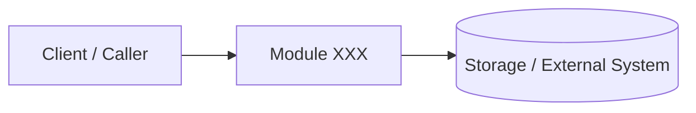

# RnD-0000 - Название темы XXX

Этот документ — «референс идеи» и архитектурных решений на уровне концепций и псевдокода.
Он не обязан быть привязан к конкретной структуре кода, но должен фиксировать важные предпосылки, границы и механизмы.

## TL;DR (заполняет автор)

**Что строим:** ...

**Зачем:** ...

**Ключевая идея в 1–2 фразы:** ...


## Контекст и границы

**Контекст:**
- В какой системе/продукте живёт модуль/фича: ...

**Границы ответственности:**
- Что делает: ...
- Что не делает: ...

**Внешние зависимости/интеграции (если есть):**
- ...


## Цели, качества, принципы

**Цели (3–7):**
- ...

**Качества (качество системы / quality attributes):**
- Надёжность: ...
- Производительность: ...
- Безопасность: ...
- Поддерживаемость: ...
- Наблюдаемость: ...

**Принципы (design principles):**
- ...
- ...
- ...


## Обзор решения

Короткое описание архитектуры, основных компонентов и того, как они взаимодействуют.

### Диаграмма (опционально)



## Обзор доступных библиотек и инструментов

**Библиотеки:**
- Библиотека 1: ...
- Библиотека 2: ...
- ...

**Инструменты:**
- Инструмент 1: ...
- Инструмент 2: ...
- ...

### Сравнение и выбор инструментов
| Инструмент   | Плюсы | Минусы | Вывод |
| :----------- | :---- | :----- | :---- |
| Инструмент 1 | ...   | ...    | ...   |
| Инструмент 2 | ...   | ...    | ...   |


| Библиотека   | Плюсы | Минусы | Вывод |
| :----------- | :---- | :----- | :---- |
| Библиотека 1 | ...   | ...    | ...   |
| Библиотека 2 | ...   | ...    | ...   |

### Вывод по выбору инструментов и библиотек
- ... (кратко, что выбрано и почему)
- ... (если есть компромиссы или риски, связанные с выбором)
- ... (если есть открытые вопросы по инструментам, которые нужно решить до реализации)


## Компоненты и механизмы архитектуры

### Компонент 1: ...

Описание компонента 1, его роль в архитектуре и взаимодействие с другими компонентами.

**Ответственность:** ...

**Входы/выходы (концептуально):**
- Вход: ...
- Выход: ...

**Инварианты/гарантии:**
- ...

### Компонент 2: ...

...

### Подход / паттерн: ...

Описание логики реализуемого бизнес-процесса и того как он перекладывается на архитектуру и код. Если есть, то описание паттерна проектирования, который используется для реализации этого процесса.


## Потоки данных и сценарии (на уровне идей)

### Сценарий 1 (happy path)

1. ...
2. ...
3. ...

### Сценарий 2 (ошибки / деградация)

1. ...
2. ...


## Псевдокод (только значимые детали)

```text
function main(input):
	validate(input)
	state = load_state(...)
	result = core_algorithm(state, input)
	persist(result)
	return result
```


## Компромиссы, альтернативы, риски

**Компромиссы:**
- ...

**Альтернативы (и почему не выбраны):**
- ...

**Риски:**
- ...


## Открытые вопросы

- ...


## Ресурсы и ссылки

> Для ссылки на ресурс используется синтаксис: [^1], [^2], [^3], ...

- [^1]: ... (ресурс 1)
- [^2]: ... (ресурс 2)
- [^3]: ... (ресурс 3)

### Связанные документы (опционально)

- Feature spec: FT-....
- Change spec: CH-....